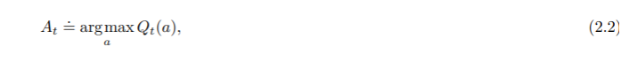

## 2.2 Action-value Methods

- _Action-value methods_ are methods for estimating the values of actions and for using the estimates to make action selection decisions.

- The true value of an action is the mean reward when that action is selected

- If the denominator is zero, then instead define _Qt(a)_ converges to _q*(a)_. This is the _sample-average_ method.

- Simplest action selection rule is to select one of the actions with the highest estimated value. Write this _greedy_ action selection method as:

where argmaxa denotes action a for which the expression that follows is maximised. A simple alternative is to behave greedily most of the time, but every once in a while, say with small probability epsilon, instead select randomly from among all the actions with equal probability, independently of the action-value estimates. Methods using this near-greedy action selection rule are epsilon-greedy methods. An advantage is that, in the limit as the number of steps increases, every action will be sampled an infinite number of times, thus ensuring that all the Qt(a) converge to their respective q*(a). The probability of selecting the optimal action converges to greater than 1 - epsilon, that is, to near certainty. 
