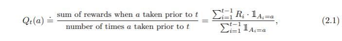

## 2.2 Action-value Methods

- _Action-value methods_ are methods for estimating the values of actions and for using the estimates to make action selection decisions.

- The true value of an action is the mean reward when that action is selected

- If the denominator is zero, then instead define _Qt(a)_ converges to _q*(a)_. This is the _sample-average_ method.
